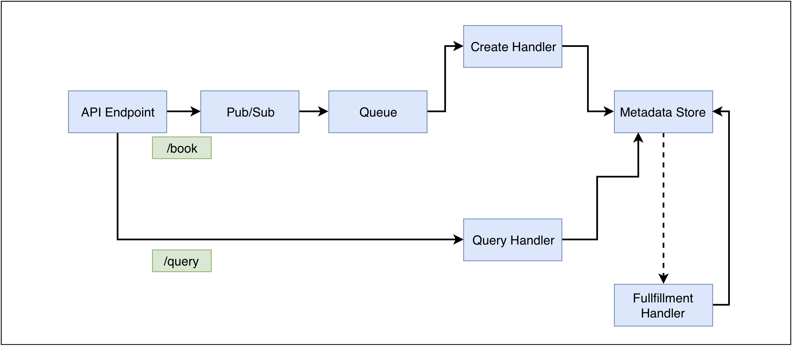
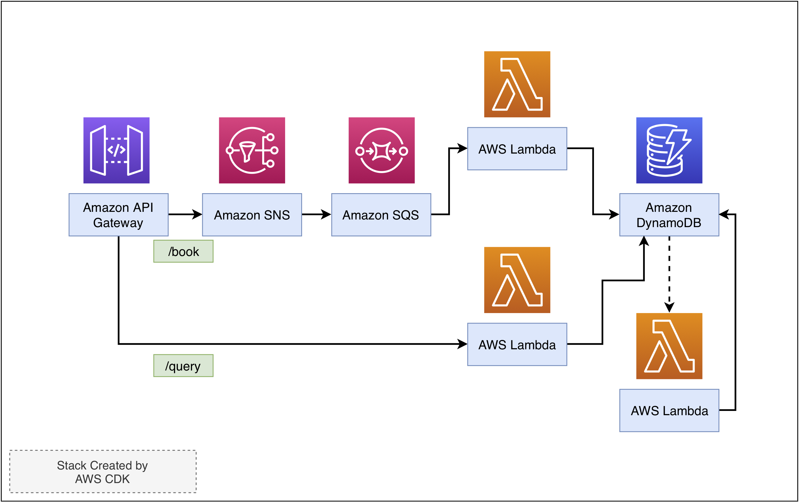

# SVS327 - Building Serverless App with AWS CDK

In this lab, we will walk you through building a simple serverless booking API with AWS CDK.

## Architecture Overview

## Services Overview

- [x] ##### Lab1 - Prepare your AWS CDK environment

- [x] ##### Lab2 - Create Amazon API Gateway, Amazon SNS and Amason SQS with AWS CDK

- [x] ##### Lab3 - Create the DynamoDB Table

- [x] ##### Lab4 - Create the order intaking handler Lambda function

- [x] ##### Lab5 - Create the order fullfillment handler Lambda function

- [x] ##### Lab6 - Create the order query Lambda function

- [x] ##### Lab7 -  testing

- [x] ##### Lab8 - clean up

