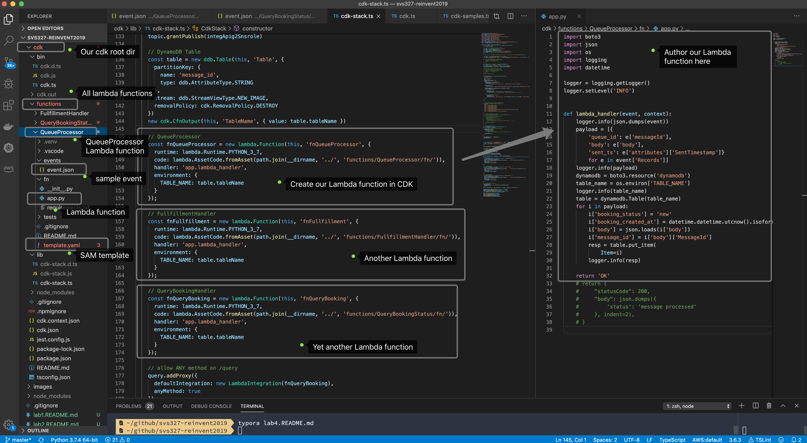
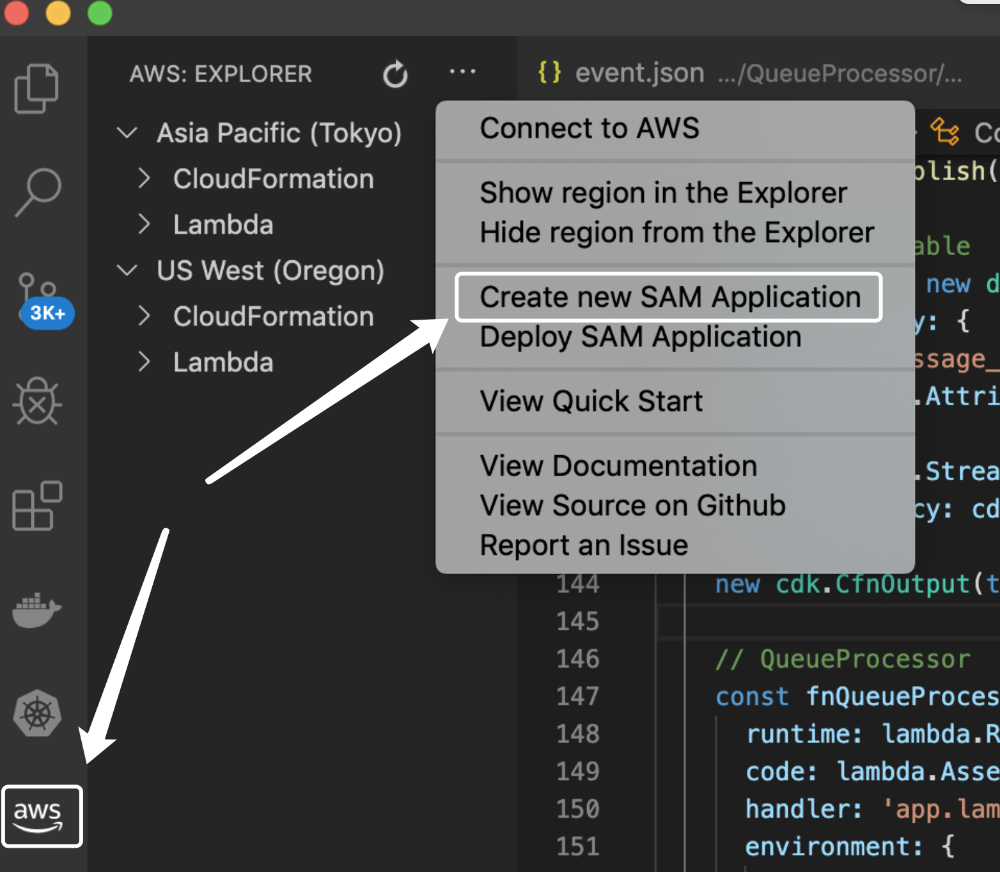
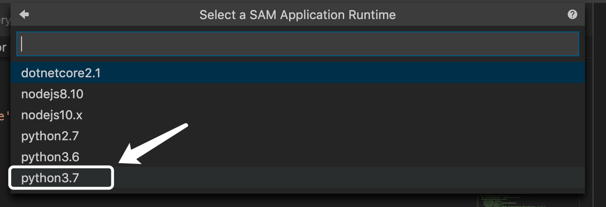
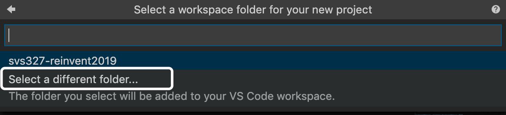
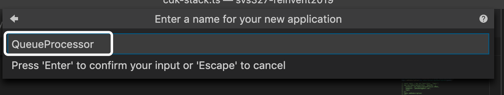

# Lab 4 - Create the Lambda functions

In the previous lab, we have created the **DynamoDB** table, however, we need a worker to pickup messages from SQS queue and persist into DynamoDB table, We need write a Lambda function for that.

Our logic flow would be like this

1. When messages come into SQS queue, trigger the **QueueProcessor** Lambda function to process it
2. The **QueueProcessor** can optionally validate the request and save into DynamoDB table when everything is good.

3. When new item is inserted into DynamoDB table, the DynamoDB stream will receive an event, triggering another Lambda function to fullfill the booking requesst(**FullfillmentHandler**)
4. The **FullfillmentHandler** proceed the booking request by calling other APIs from your own business logic. When booking is fulfilled, update the booking status in DynamoDB by adding some extra attributes to the existing item.
5. The 3rd Lambda function is **QueryBookingStatus**, which serves as the Lambda integragtion for **/query** API. When the client sends the query request with **HTTP GET /query**, it simply checks the status from the DynamoDB table and returns to the client.

OK here we go!

## Create Lambda function with AWS Toolkit for VSCode

Let's install **AWS Toolkit for VSCode** and simply create a SAM Application under **{base}/cdk/functions/** directory. For more introduction and tutorial videos about the **AWS Toolkit for VSCode**, check it out [here](https://aws.amazon.com/visualstudiocode/).

Your VSCode workspace may look like this




**Create a new SAM Application** which contains the Lambda function, SAM template and sample event JSON file.



Select our runtime.



Let's select adifferent folder. Make sure you have `mkdir functions` under the `cdk` folder and selecg the `functions` folder in this prompt.



Type the function name. In this case, we name it **QueueProcessor**.




OK your sample SAM application with Python 3.7 runtime should be created. Usually you should be able to see the **run it locally** link in the IDE and simply click the link you can invoke the sample lambda function locally and see its output in VSCode. However, if you can't find the run it locally, that might because of thie [known issue](https://github.com/aws/aws-toolkit-vscode/issues/804) not being fixed.

Don't panic, you still can run it manually with thsi command in the built-in terminal:

```sh
sam local invoke HelloWorldFunction --template template.yaml --event events/event.json
```

This is very ideal for local development and debugging. You simply modify the `events/event.json` and `app.py` Lambda function and execute `sam local invoke` to test it locally and iterate your Lambda development.

Similarily, you can create other 2 lambda functions like this in VScode and test it locally. 

Before deploy it, we need to connect them together and grant them required IAM policies.

```js
    // allow ANY method on /query
    query.addProxy({
      defaultIntegration: new LambdaIntegration(fnQueryBooking),
      anyMethod: true
    })
    new cdk.CfnOutput(this, 'QueryAPIEndpoint', { value: `${query.url}/{message_id}` })

    fnQueueProcessor.addEventSource(new SqsEventSource(queue))
    table.grantReadWriteData(fnQueueProcessor)
    fnFullfillment.addEventSource(new DynamoEventSource(table, {
      startingPosition: lambda.StartingPosition.LATEST
    }))
    table.grantStreamRead(fnFullfillment)
    table.grantReadWriteData(fnFullfillment)
    table.grantReadData(fnQueueProcessor)
    table.grantReadWriteData(fnQueryBooking)
```


OK, let's deploy it just as you do previously with other AWS resources. Just `cdk deploy` it.


```sh
$ cdk deploy
```

Your Lambda functions would be added into your CDK application stack.

Check our CDK source code for this lab [here](https://github.com/pahud/svs327-reinvent2019/blob/04ee35b11105de4ae8bfafc47a3de06a42488b75/cdk/lib/cdk-stack.ts#L146-L191) and Lambda function source code [here](https://github.com/pahud/svs327-reinvent2019/tree/master/cdk/functions).

OK. That's all. Let's move to [Lab 5](lab5.README.md) to verify it.
